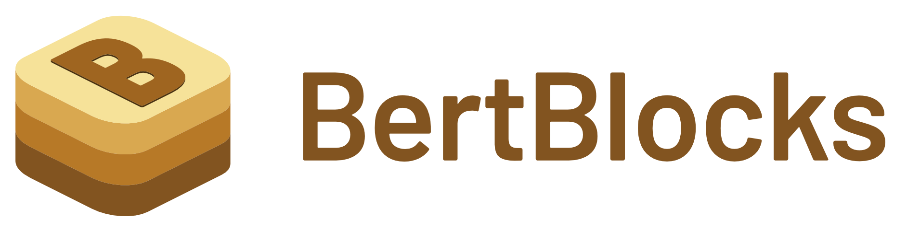

<div align="center">



<br/>
<br/>
</div>

## Overview

**BertBlocks** provides building blocks for exploring transformer encoders. It aims to provide a unified, clean, well-documented, and comprehensive collection of building blocks for BERT-like models.
It is highly configurable and allows for easy experimentation with various architectural components including:

- **Normalization**: RMS Norm, Layer Norm, Group Norm, DeepNorm, DynamicTanhNorm, ...
- **Attention Mechanisms**: Multi-head attention with configurable heads and dropout
- **Positional Encodings**: ALiBi, Sinusoidal, RoPE, Relative, Learned, ...
- **Feed-Forward Networks**: Standard MLP, Gated Linear Units (GLU)...
- **Activation Functions**: SiLU, GELU, ReLU, ...
- **Optimization**: Pre/post normalization, dropout configurations, ...

## Quick Start

### Basic Usage

Train a model with the default configuration:

```bash
uv run main.py fit --config configs/pretraining.yaml
```

### Configuration

The architecture is configurable through the `BertBlocksConfig` class. Key parameters include:

```python
import bertblocks as bb

config = bb.BertBlocksConfig(
    vocab_size=30522,        # Vocabulary size
    hidden_size=768,         # Model dimension
    num_blocks=12,           # Number of transformer layers
    num_attention_heads=12,  # Number of attention heads
    norm_fn="rms",           # Normalization type
    pos_emb_kind="alibi",    # Positional encoding
    mlp_type="glu",          # Feed-forward architecture
    actv_fn="silu"           # Activation function
)

model = bb.BertBlocksForMaskedLM(config)
```

Alternatively, select Huggingface encoder architectures can be reproduced, optionally also loading their weights:

```python
import bertblocks as bb

# Returns an equivalent BertBlocks model
model = bb.from_huggingface("answerdotai/ModernBERT-base", load_weights=True)
```

We are actively working on adding more verified model loaders. If you want to contribute, have a look at [`bertblocks.compat`](bertblocks/compat).

## License

This project is licensed under the MIT License - see the [LICENSE](LICENSE) file for details.

## Citation

If you use this code in your research, please cite:

```bibtex
@software{bertblocks,
  title  = {BertBlocks - Building Blocks for Exploring Transformer Encoders},
  author = {CORAL Project Contributors},
  year   = {2025},
  url    = {https://github.com/your-repo/encoder-architecture-search}
 }
```
