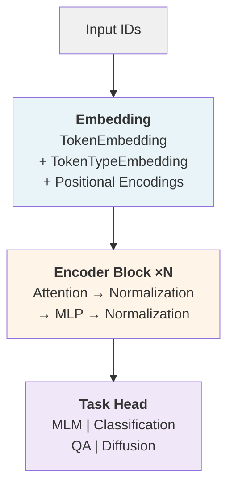

# Architecture Overview

BertBlocks implements a modular transformer encoder where each component can be independently
configured and swapped. This page describes how the pieces fit together.

## Model Structure

A BertBlocks model consists of three main stages:

1. **Embedding** -- Token and (optionally) token-type embeddings, plus optional embedding-level positional encodings
2. **Encoder** -- A stack of transformer blocks
3. **Head** -- Task-specific output heads (MLM, classification, QA, etc.)

## Transformer Block

Each {class}`~bertblocks.modeling.block.Block` contains:

- **Multi-head attention** ({class}`~bertblocks.modeling.attention.Attention`) with configurable head count, dropout, and optional grouped query attention (GQA)
- **Feed-forward network** ({func}`~bertblocks.modeling.mlp.get_mlp`) -- standard MLP or Gated Linear Unit (GLU)
- **Normalization** ({func}`~bertblocks.modeling.norms.get_norm`) applied pre-attention, post-attention, or both

The normalization position is controlled by the `norm_pos` config key and supports `"pre"`, `"post"`, `"pre_and_post"`, or `"none"`.

## Attention

The {class}`~bertblocks.modeling.attention.Attention` module supports:

- **Positional encodings at the block level**: ALiBi, RoPE (applied per-block, not at embedding time)
- **Backends**: Flash Attention, SDPA, or eager (plain PyTorch), selected via the `attention_backend` config key
- **Grouped Query Attention**: set `num_kv_heads` < `num_attention_heads`
- **QK normalization**: via `qk_norm`
- **Local attention**: via `local_attention` and `local_attention_window_size`

Backends are implemented as {class}`~bertblocks.modeling.backends.AttentionBackend` subclasses and handle both padded and unpadded (variable-length) sequences.

## Positional Encodings

BertBlocks supports positional encodings at two levels:

| Level | Config key | Options |
|-------|-----------|---------|
| Embedding | `embd_pos_enc_kind` | `"sinusoidal"`, `"learned"`, `"none"` |
| Block | `block_pos_enc_kind` | `"alibi"`, `"rope"`, `"none"` |

Embedding-level encodings are added once to the token embeddings. Block-level encodings are applied inside each attention computation.

## Normalization

Available normalization functions (set via `norm_fn`):

| Value | Class |
|-------|-------|
| `"layer"` | `torch.nn.LayerNorm` |
| `"rms"` | `torch.nn.RMSNorm` |
| `"group"` | `torch.nn.GroupNorm` |
| `"deep"` | {class}`~bertblocks.modeling.norms.DeepNorm` |
| `"dynamic_tanh"` | {class}`~bertblocks.modeling.norms.DynamicTanhNorm` |

## Feed-Forward Networks

The `mlp_type` config key selects between:

- `"mlp"` -- Standard two-layer MLP with activation
- `"glu"` -- Gated Linear Unit with configurable activation (SwiGLU, GeGLU, etc.)

Both are accessed through {func}`~bertblocks.modeling.mlp.get_mlp`.

## Task Heads

BertBlocks provides several task-specific model wrappers:

| Class | Task |
|-------|------|
| {class}`~bertblocks.modeling.model.BertBlocksForMaskedLM` | Masked language modeling |
| {class}`~bertblocks.modeling.model.BertBlocksForSequenceClassification` | Sequence classification |
| {class}`~bertblocks.modeling.model.BertBlocksForTokenClassification` | Token classification (NER) |
| {class}`~bertblocks.modeling.model.BertBlocksForQuestionAnswering` | Extractive QA |
| {class}`~bertblocks.modeling.model.BertBlocksForMaskedDiffusion` | Masked diffusion modeling |

All inherit from {class}`~bertblocks.modeling.model.BertBlocksPreTrainedModel` and are compatible with HuggingFace's `AutoModel` registry.
